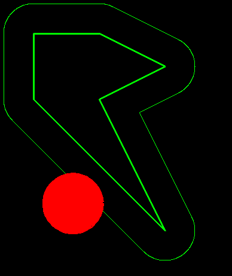

# Pinball
Hallo, dieses Projekt ist etwas größer außgeartet als erwartet. Deshalb hier eine kurze Erklärung der Komponente.
!!Wichtig!! Bisher nur unter Linux getestet (aufgrund von fehlender Macs und einer Abneigung zu Windows).

## Kollisionen
Kollisionen werden nicht mithilfe von einzelnen Schritten berechnet, sondern die Bahnkurve wird mithilfe von Polynomen beschrieben. Genauer gesagt einem Polynom für die x-Position abhängig von der Zeit und einem für die y-Position.
Kollisionen werden dann mithilfe dieser Polynome berechnet, indem für die verschiedenen Kollisionsobjekte formeln aufgestellt werden, in die dann die Polynome eingesetzt werden. Die resultierenden Gleichungen werden dann gelöst und die Zeitpunkte der Kollisionen bestimmt.
### Beispiel, Kollision mit einem Kreis
Ein Kreis ist definiert durch den Mittelpunkt $(x_0, y_0)$ und den Radius r. Die Bahnkurve ist gegeben durch die Polynome $x(t)$ und $y(t)$. Dann ist die Kollision gegeben durch die Gleichung
$(x(t) - x_0)^2 + (y(t) - y_0)^2 - r^2 = 0$
Diese Gleichung wird gelöst und die Zeitpunkte der Kollisionen bestimmt.
### Form vs Path
Da wir mit Bällen arbeiten, die einen Radius haben und nicht mit Punkten, müssen wir die Kollisionen auch mit dem Radius des Balls berechnen. Dazu werden sog. Paths mit dem Abstand des Radius um die Formen gelegt. Die Kollisionen werden dann zwischen dem Mittelpunkt des Balls und den Paths berechnet.

#### Beispiel: Paths um eine Polygon-Form:


### Reflektion
Die Reflektion des Balls an einer Kollisionsfläche wird mithilfe der Normalen an der Kollisionsfläche berechnet. Die Geschwindigkeit des Balls wird dann an der Normalen gespiegelt. Zeitpunkt der Kollision, Bahnkurve des Balls und Kollisionsform wird in der Klasse `SimpleCollision` gespeichert. Diese Klasse kann den Reflektionsvektor berechnen.
### Rotierende Objekte
Um kollisionen mit rotierenden Objekten zu berechnen, wird die Bahnkurve des Balls in ein Koordinatensystem transformiert, das mit dem rotierenden Objekt mitrotiert. Die Kollisionen werden dann in diesem Koordinatensystem berechnet. Danach müssen die Kollisionen wieder in das ursprüngliche Koordinatensystem transformiert werden, weshalb die Reflektionsvektoren mit einem Winkel zurückgedreht werden müssen. Hier wird `RotatedCollision` als Wrapper um `SimpleCollision` verwendet. Um die Bahnkurve zu drehen, wird die Taylor-Entwicklung von Sinus und Cosinus verwendet.
### Wiederholende / Periodische Bewegungen
Da die Taylor-Entwicklungen von Sinues und Cosinus mit höheren Winkeln ungenauer werden, kann nicht eine einzelne rotierende Form verwendet werden um ein Objekt darzustellen, dass sich endlos dreht. Deshalb wird eine `PeriodicForm` verwendet, die Verschiedene Objekte hat, die jeweils eine Dauer haben, während der sie verwendet werden. Bei einer Rotierenden Form könnten dies zum Beispiel kopien der rotierenden Form zwischen 0° und 90°, 90° und 180°, 180° und 270°, 270° und 0° sein. 
## Parallelisierung
Die Berechnung der Kollisionen wird in einem separatem Prozess durchgeführt. Dazu wird die Bibliothek `multiprocessing` verwendet. In diesem Prozess werden die Kollisionen berechnet und in einer `Queue` namens `out_queue` gespeichert. Es werden auch die Formen Bälle übertragen, falls sich diese verändert haben. Der Hauptprozess liest dann die Kollisionen aus der Queue und führt die Kollisionen durch. Dies wird hinter der CollThread-Klasse Abstrahiert.
Da der Prozess nichts über zukünftige user-inputs wird die Berechnung der Kollisionen neu gestartet, wenn zum Beispiel ein Flipper betätigt wird. Deshalb hat der Prozess eine `in_queue`, in die neue Formen und Bälle geschrieben werden. Wenn der Prozess eine neue Form oder einen neuen Ball erhält, wird die Berechnung der Kollisionen neu gestartet.
## Ballang (Programmiersprache)
Um das Verhalten der Formen in der Szene zu definieren, wird eine eigene Programmiersprache verwendet. Diese ist sehr einfach gehalten. Da die implementation dieser Sprache über den Rahmen dieser Veranstaltung hinausgeht, hatten wir mit Herr Ferber abgesprochen, dass nur ich, (Arne) während der Präsentation zur Sprache gefragt werde.
### Grammatik
```
file -> function*
function -> "def" ANY_WORD "(" func_arg* ")" block
func_arg -> ANY_WORD
block -> "{" (if_statement | while_loop | statement)* "}"
if_statement -> "if" expression block ("else" "if" expression block)* ("else" block)?
while_loop -> "while" expression block
statement -> return | var_def | func_call | assignment
return -> "return" expression?
var_def -> "let" ANY_WORD ("=" expression)?
var -> ANY_WORD
assignment -> expression ("=" expression)?
func_call -> var "(" expression* ")"
expression -> logical_op
logical_op -> comparison ("&&" | "||" logical_op)?
comparison -> plusminus ("==" | "!=" | "<=" | ">=" | "<" | ">" comparison)?
plusminus -> dotdiv ("+" | "-" plusminus)?
dotdiv -> unary_op ("*" | "/" dotdiv)?
unary_op -> ("!" | "-") primary
primary -> func_call | var | anyNumber | anyString | "(" expression ")"
```
Um diese Grammatik zu parsen, wurde ein System von Klassen implementiert, die arbiträre Grammatiken parsen können. Diese Klassen sind in `ballang/abstract/grammar.py` implementiert und werden in `ballang/ballang.py` verwendet.
Diese Klassen können zum Beispiel ein `if`-Statement folgendermaßen definieren:
```python
if_statement.set(Sequence([
    IF,
    Labeled(expression, "condition"),
    Labeled(block, "then_block"),
    Multiple(Sequence([
        ELSE,
        IF,
        Labeled(expression, "elif_cond{#id}"),
        Labeled(block, "elif_block{#id}"),
    ])),
    Maybe(Sequence([
        ELSE,
        Labeled(block, "else_block")
    ]))
]))
```
### Verwendung im Spiel
Die Sprache wird folgendermaßen verwendet:
 - Die Formen haben ein Attribut `on_collision`, das den name einer Funktion enthält, die aufgerufen wird, wenn die Form kollidiert. Es werden keine direkten funktionen übergeben, da multiprocessing queues keine funktionen übergeben können. Stattdessen wird der Name der Funktion in der Form gespeichert und ein Dict der Funktionen dem Prozess übergeben. Der Prozess ruft dann die Funktion auf, die in der Form gespeichert ist. Der `on_collision` Funktion wird die Kollisionszeit sowie die Position des Balls in der Ball-Liste übergeben.
 - Jeden Frame wird die `on_update` Funktion aufgerufen
 - Am Anfang des Spiels wird die `on_init` Funktion aufgerufen 

Je nachdem in welchem Kontext eine Ballang-Funktion aufgerufen wird, kann sie auf unterschiedliche Funktionen zugreifen. Zum Beispiel kann in `on_update` Funktion auf die `curr_pressed` Funktion zugegriffen, die angibt, ob eine Taste gedrückt ist. In `on_collision` würde das keinen Sinn machen, da es zu dem Zeitpunkt noch nicht bekannt ist, ob eine Taste gedrückt ist. Aufgrund von Zeitmangel werden Funktionen jedes mal geparsed, wenn sie aufgerufen werden. Das ist nicht effizient, scheint aber keine Probleme zu verursachen.

Für eine Liste der in Ballang verfügbaren Funktionen siehe `ballang_interop.py`.
## Level
Level können aus einer JSON-Datei geladen werden. Diese Datei enthält die Formen, die im Level vorhanden sind, sowie den Ballang-Code um diese Formen zu steuern. 
## Steuerung
Die Steuerung des Flippers kann mithilfe von Physikalischen Knöpfen geschehen. Dazu wird ein Arduino verwendet, der die Knöpfe ausliest und über die serielle Schnittstelle an den Computer sendet. Der Computer liest die Knöpfe aus und führt die entsprechenden Aktionen durch. Der Plunger 
.png)
.png)
.png)

funktioniert so, dass es einen Magnet gibt, der sich in eine Spule bewegt, weshalb in dieser eine Spannung induziert wird. Diese wird mit dem Anrduino gemmessen und genauso wie die Knopfdaten an den Computer gesendet.
Da die Induziertiert Spannung zu hoch ist wird ein Kondensator und mehrere Widerstände verwendet. (Bild einfügen)

Alternativ ist auch eine Steuerung per Tastatur möglich. Hierbei werden die Flipperarme jeweils von der linken und rechten Pfeiltaste betätigt und der Ballabschuss kann per Leertaste gemacht werden.

## Externes Display
Um den Score interresanter anzuzeigen, ist am Arduino auch noch ein 2004 LCD mit I²C Backpack angeschlossen auf dem der Score und der Highscore angezeigt werden. (Bild hinzugügen)
Um den Score größer Anzuzeigen (und ihn cooler aussehen zu lassen) wurde die BigNumbers_I2C Biliothek von Anush-DP verwendet, da dies einige Zeit einspart.
